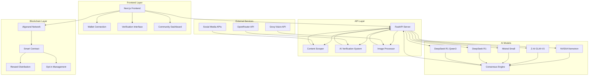

# R2E - Report to Earn: Decentralized Misinformation Detection Platform

A comprehensive Web3 platform that incentivizes users to report and verify misinformation through AI-powered content analysis, blockchain-based rewards, and community-driven verification.

## Table of Contents

- [Overview](#overview)
- [Architecture](#architecture)
- [Tech Stack](#tech-stack)
- [Project Structure](#project-structure)
- [Features](#features)
- [Getting Started](#getting-started)
- [Deployment](#deployment)
- [API Documentation](#api-documentation)
- [Smart Contracts](#smart-contracts)
- [Frontend](#frontend)
- [AI Verification System](#ai-verification-system)
- [Contributing](#contributing)
- [License](#license)

## Overview

R2E (Report to Earn) is a decentralized platform that combats misinformation by rewarding users for accurate reporting and verification. The platform combines advanced AI verification systems, blockchain technology, and community-driven fact-checking to create a trustworthy information ecosystem.

### Key Components

- **AI Verification System**: Multi-agent AI system using 5 different models for content verification
- **Multi-Model AI Verification**: Advanced ensemble of 5 specialized AI models working in parallel for comprehensive content analysis
- **Blockchain Integration**: Algorand-based smart contracts for transparent reward distribution
- **Web Frontend**: Modern Next.js interface for user interaction
- **Content Scraping**: Automated content extraction from multiple social media platforms
- **Dynamic Rewards**: Algorithm-based reward calculation based on content popularity and verification accuracy
- **Transparent Reporting**: Public verification reports with detailed reasoning and evidence
- **Multi-language Support**: Global accessibility with support for multiple languages and regions


## Architecture



## Tech Stack

### Frontend
- **Framework**: Next.js 14.2.16
- **Language**: TypeScript
- **Styling**: Tailwind CSS
- **Animations**: Framer Motion
- **Blockchain**: Algorand SDK (@perawallet/connect)
- **State Management**: React Context

### Backend
- **Framework**: FastAPI
- **Language**: Python 3.8+
- **AI/ML**: LangGraph, LangChain
- **Image Processing**: Pillow, Groq Vision
- **Web Scraping**: Selenium, BeautifulSoup4
- **HTTP Client**: httpx, requests

### Blockchain
- **Network**: Algorand Testnet/Mainnet
- **Smart Contracts**: TEAL (Transaction Execution Approval Language)
- **SDK**: Algorand SDK (algosdk)
- **Wallet Integration**: Pera Wallet

### AI Models
- **Text Analysis**: 5 Free OpenRouter Models (128K-164K context limits):
    - *NVIDIA Nemotron Nano 9B v2* (128K context)
    - *DeepSeek R1* (164K context - highest)
    - *Z-AI GLM 4.5 Air* (131K context)
    - *Mistral Small 3.2 24B Instruct* (131K context)
    - *DeepSeek R1 Qwen3 8B* (131K context)
- **Vision Processing**: Groq Vision Models (Llama 4)
- **Consensus**: Custom multi-agent decision system

### Infrastructure
- **Containerization**: Docker
- **Deployment**: Vercel (Frontend), Railway/Render (Backend)
- **Environment**: Node.js, Python

## Project Structure

```
r2e/
├── ai-verify/                    # AI Verification Backend
│   ├── main.py                   # FastAPI server entry point
│   ├── ai_verification_system.py # Multi-agent AI system
│   ├── content_scraper.py        # Social media content scraper
│   ├── image_processor.py        # Image analysis and processing
│   ├── requirements.txt          # Python dependencies
│   ├── Dockerfile               # Container configuration
│   └── nixpacks.toml           # Deployment configuration
├── frontend/                     # Next.js Web Application
│   ├── app/                     # App Router pages
│   │   ├── page.tsx            # Landing page
│   │   ├── verify/             # Verification interface
│   │   └── community/          # Community dashboard
│   ├── components/             # React components
│   │   ├── ui/                 # Reusable UI components
│   │   ├── SmartContractVerificationFlow.tsx
│   │   ├── Leaderboard.tsx
│   │   └── RandomLiveFeed.tsx
│   ├── contexts/               # React contexts
│   ├── hooks/                  # Custom React hooks
│   ├── lib/                    # Utility functions
│   └── config/                 # Configuration files
├── smart-contracts/            # Algorand Smart Contracts
│   ├── approval.teal          # Main contract logic
│   ├── clear.teal             # Contract cleanup
│   ├── deploy-contract.js     # Deployment script
│   └── deploy-creator.js      # Creator account setup
└── README.md                   # This file
```

## Features

### Core Features
- **Multi-Platform Content Verification**: Support for Twitter, Instagram, Reddit, YouTube, and generic websites
- **AI-Powered Analysis**: 5 different AI models working in consensus
- **Dynamic Reward System**: Rewards based on content popularity and verification accuracy
- **Blockchain Integration**: Transparent reward distribution via Algorand smart contracts
- **Real-time Processing**: Fast content analysis and verification
- **Community Dashboard**: Leaderboards and community statistics

### Advanced Features
- **Image Analysis**: Advanced image processing with manipulation detection
- **Content Scraping**: Automated extraction from social media platforms
- **Wallet Integration**: Seamless Algorand wallet connection
- **Responsive Design**: Mobile-first, modern UI/UX
- **Real-time Updates**: Live feed of verification activities

## Getting Started

### Prerequisites

- Node.js 18+ and npm/pnpm
- Python 3.8+
- Algorand wallet (Pera Wallet recommended)
- API keys for OpenRouter and Groq

### Installation

1. **Clone the repository**
   ```bash
   git clone https://github.com/your-username/r2e.git
   cd r2e
   ```

2. **Install Frontend Dependencies**
   ```bash
   cd frontend
   npm install
   # or
   pnpm install
   ```

3. **Install Backend Dependencies**
   ```bash
   cd ../ai-verify
   pip install -r requirements.txt
   ```

4. **Install Smart Contract Dependencies**
   ```bash
   cd ../smart-contracts
   npm install
   ```

### Environment Setup

1. **Backend Environment Variables**
   Create `ai-verify/.env`:
   ```env
   OPENROUTER_API_KEY=your_openrouter_api_key
   GROQ_API_KEY=your_groq_api_key
   ```

2. **Frontend Environment Variables**
   Create `frontend/.env.local`:
   ```env
   NEXT_PUBLIC_ALGOD_TOKEN=your_algod_token
   NEXT_PUBLIC_ALGOD_SERVER=https://testnet-api.algonode.cloud
   NEXT_PUBLIC_ALGOD_PORT=443
   NEXT_PUBLIC_REWARD_CONTRACT_APP_ID=your_deployed_app_id
   ```

3. **Smart Contract Configuration**
   Create `smart-contracts/.env`:
   ```env
   ALGOD_TOKEN=your_algod_token
   ALGOD_SERVER=https://testnet-api.algonode.cloud
   ALGOD_PORT=443
   ```

### Running the Application

1. **Start the AI Verification Backend**
   ```bash
   cd ai-verify
   python main.py
   ```
   Server runs on `http://localhost:8000`

2. **Start the Frontend Development Server**
   ```bash
   cd frontend
   npm run dev
   # or
   pnpm dev
   ```
   Application runs on `http://localhost:3000`

3. **Deploy Smart Contracts** (Optional for development)
   ```bash
   cd smart-contracts
   node deploy-contract.js
   ```

## Deployment

### Frontend Deployment (Vercel)

1. **Connect to Vercel**
   ```bash
   cd frontend
   vercel login
   vercel --prod
   ```

2. **Set Environment Variables**
   - `NEXT_PUBLIC_ALGOD_TOKEN`
   - `NEXT_PUBLIC_ALGOD_SERVER`
   - `NEXT_PUBLIC_ALGOD_PORT`
   - `NEXT_PUBLIC_REWARD_CONTRACT_APP_ID`

### Backend Deployment (Railway/Render)

1. **Using Railway**
   ```bash
   cd ai-verify
   railway login
   railway init
   railway up
   ```

2. **Using Render**
   - Connect GitHub repository
   - Set build command: `pip install -r requirements.txt`
   - Set start command: `python main.py`
   - Add environment variables

### Smart Contract Deployment

1. **Deploy to Algorand Testnet**
   ```bash
   cd smart-contracts
   node deploy-contract.js
   ```

2. **Deploy to Algorand Mainnet**
   - Update network configuration
   - Ensure sufficient ALGO balance
   - Run deployment script

## API Documentation

### Base URL
- Development: `http://localhost:8000`
- Production: `https://your-backend-url.com`

### Endpoints

#### Health Check
```http
GET /health
```

#### Verify Content
```http
POST /verify
Content-Type: application/json

{
  "content_url": "https://example.com/content",
  "content_text": "Content to verify...",
  "content_images": ["image1.jpg", "image2.jpg"]
}
```

#### Scrape and Verify
```http
POST /scrape-and-verify
Content-Type: application/json

{
  "url": "https://twitter.com/username/status/1234567890"
}
```

#### Get Available Models
```http
GET /agents
```

**Response:**
```json
{
  "models": [
    {
      "name": "NVIDIA Nemotron Nano 9B v2",
      "model_id": "nvidia/nemotron-nano-9b-v2:free",
      "context_limit": "128,000 tokens",
      "created": "September 5, 2025",
      "pricing": "$0/M input tokens, $0/M output tokens",
      "specialty": "Efficient reasoning and fact-checking",
      "strengths": "Fast processing, good at logical analysis"
    },
    {
      "name": "DeepSeek R1",
      "model_id": "deepseek/deepseek-r1:free",
      "context_limit": "163,840 tokens",
      "created": "January 20, 2025",
      "pricing": "$0/M input tokens, $0/M output tokens",
      "specialty": "Latest reasoning model",
      "strengths": "State-of-the-art analysis, cutting-edge capabilities"
    },
    {
      "name": "Z-AI GLM 4.5 Air",
      "model_id": "z-ai/glm-4.5-air:free",
      "context_limit": "131,072 tokens",
      "created": "July 25, 2025",
      "pricing": "$0/M input tokens, $0/M output tokens",
      "specialty": "Chinese-developed model with unique perspective",
      "strengths": "Different cultural context, alternative viewpoints"
    },
    {
      "name": "Mistral Small 3.2 24B Instruct",
      "model_id": "mistralai/mistral-small-3.2-24b-instruct:free",
      "context_limit": "131,072 tokens",
      "created": "June 20, 2025",
      "pricing": "$0/M input tokens, $0/M output tokens",
      "specialty": "High-quality instruction following",
      "strengths": "Detailed analysis, comprehensive reasoning"
    },
    {
      "name": "DeepSeek R1 Qwen3 8B",
      "model_id": "deepseek/deepseek-r1-0528-qwen3-8b:free",
      "context_limit": "131,072 tokens",
      "created": "May 29, 2025",
      "pricing": "$0/M input tokens, $0/M output tokens",
      "specialty": "Advanced reasoning capabilities",
      "strengths": "Complex logical analysis, pattern recognition"
    }
  ],
  "workflow": "Parallel analysis with consensus-based decision-making",
  "total_models": 5,
  "consensus_method": "Majority voting with confidence weighting",
  "total_context_range": "128K-164K tokens"
}
```

### Response Format

```json
{
  "success": true,
  "result": {
    "final_decision": "authentic|fake|uncertain",
    "confidence": 0.85,
    "consensus_score": 0.75,
    "popularity_score": 0.75,
    "dynamic_reward": 0.1875,
    "individual_decisions": [...],
    "group_reasoning": "Detailed explanation..."
  },
  "scraped_content": {
    "platform": "twitter",
    "url": "https://twitter.com/username/status/1234567890",
    "content_text": "Scraped text content...",
    "content_images": ["image1.jpg", "image2.jpg"],
    "author": {"username": "username", "full_name": "Full Name"},
    "engagement": {"likes": 100, "comments": 50, "shares": 25},
    "metadata": {...}
  }
}
```

## Smart Contracts

### Contract Overview
The R2E smart contract manages reward distribution and user opt-in functionality on the Algorand blockchain.

### Key Features
- **User Opt-in**: Users must opt into the contract to claim rewards
- **One-time Claims**: Each user can claim rewards only once
- **Automatic Distribution**: Contract automatically sends ALGO to users
- **Creator Control**: Only contract creator can update/delete contract

### Contract Functions
- `opt_in()`: User opts into the contract
- `claim_reward()`: User claims their reward
- `update_contract()`: Creator updates contract (admin only)
- `delete_contract()`: Creator deletes contract (admin only)

### Deployment Process
1. Compile TEAL programs
2. Create application transaction
3. Sign and submit transaction
4. Wait for confirmation
5. Extract application ID

## Frontend

### Key Components

#### SmartContractVerificationFlow
Main verification interface handling the complete verification process.

#### Leaderboard
Community dashboard showing top contributors and statistics.

#### RandomLiveFeed
Real-time feed of verification activities and community updates.

### Wallet Integration
- **Pera Wallet**: Primary wallet integration
- **Algorand SDK**: Blockchain interaction
- **Transaction Management**: Automatic transaction handling

### State Management
- **React Context**: Global state management
- **Wallet Context**: Wallet connection state
- **Theme Provider**: Dark/light mode support

## AI Verification System

### Multi-Agent Architecture
The system uses 5 different AI models working in parallel:

1. **NVIDIA Nemotron Nano 9B v2** (`nvidia/nemotron-nano-9b-v2:free`)
   - **Context Limit**: 128,000 tokens
   - **Created**: September 5, 2025
   - **Pricing**: $0/M input tokens, $0/M output tokens
   - **Specialty**: Efficient reasoning and fact-checking
   - **Strengths**: Fast processing, good at logical analysis

2. **DeepSeek R1** (`deepseek/deepseek-r1:free`)
   - **Context Limit**: 163,840 tokens (highest context)
   - **Created**: January 20, 2025
   - **Pricing**: $0/M input tokens, $0/M output tokens
   - **Specialty**: Latest reasoning model
   - **Strengths**: State-of-the-art analysis, cutting-edge capabilities

3. **Z-AI GLM 4.5 Air** (`z-ai/glm-4.5-air:free`)
   - **Context Limit**: 131,072 tokens
   - **Created**: July 25, 2025
   - **Pricing**: $0/M input tokens, $0/M output tokens
   - **Specialty**: Chinese-developed model with unique perspective
   - **Strengths**: Different cultural context, alternative viewpoints

4. **Mistral Small 3.2 24B Instruct** (`mistralai/mistral-small-3.2-24b-instruct:free`)
   - **Context Limit**: 131,072 tokens
   - **Created**: June 20, 2025
   - **Pricing**: $0/M input tokens, $0/M output tokens
   - **Specialty**: High-quality instruction following
   - **Strengths**: Detailed analysis, comprehensive reasoning

5. **DeepSeek R1 Qwen3 8B** (`deepseek/deepseek-r1-0528-qwen3-8b:free`)
   - **Context Limit**: 131,072 tokens
   - **Created**: May 29, 2025
   - **Pricing**: $0/M input tokens, $0/M output tokens
   - **Specialty**: Advanced reasoning capabilities
   - **Strengths**: Complex logical analysis, pattern recognition

### Consensus Mechanism
- **Individual Analysis**: Each model analyzes content independently
- **Confidence Scoring**: Models provide confidence scores
- **Majority Voting**: Final decision based on majority consensus
- **Weighted Scoring**: Confidence scores influence final decision

### Dynamic Reward System
- **Base Reward**: 0.05 ALGO for detecting fake content
- **Popularity Multiplier**: 1.0x to 5.0x based on content popularity
- **Maximum Reward**: 1.0 ALGO (capped)
- **Formula**: `Dynamic Reward = Base Fee × Popularity Multiplier`
### Reward Calculation Algorithm

The dynamic reward system uses a sophisticated algorithm to calculate rewards based on multiple factors:

#### Base Components
- **Detection Reward**: 0.05 ALGO for successfully identifying fake content
- **Verification Bonus**: Additional 0.02 ALGO for high-confidence verification
- **Community Consensus**: 0.01 ALGO bonus when multiple users report the same content

#### Popularity Metrics
The popularity multiplier is calculated using:
- **Social Media Engagement**: Likes, shares, comments, views
- **Content Virality Score**: Rate of spread across platforms
- **Temporal Relevance**: How recent the content is
- **Platform Weight**: Different platforms have different impact factors

#### Multiplier Calculation


### Image Processing
- **Vision Models**: Llama 4 Scout and Maverick
- **OCR**: Text extraction from images
- **Manipulation Detection**: AI-generated content detection
- **Multi-image Support**: Process up to 5 images per request

## Contributing

### Development Setup
1. Fork the repository
2. Create a feature branch
3. Make your changes
4. Add tests if applicable
5. Submit a pull request


## License

This project is licensed under the MIT License - see the [LICENSE](LICENSE) file for details.

## Support

For support and questions:
- **GitHub Issues**: [Create an issue](https://github.com/your-username/r2e/issues)
- **Discord**: [Join our community](https://discord.gg/your-discord)
- **Email**: support@r2e.com

## Roadmap

### Phase 1 (Current)
- [x] Basic AI verification system
- [x] Algorand smart contract integration
- [x] Web frontend
- [x] Multi-platform content scraping

### Phase 2 (Next)
- [ ] Mobile application
- [ ] Advanced analytics dashboard
- [ ] Community governance
- [ ] Cross-chain support

### Phase 3 (Future)
- [ ] Decentralized storage integration
- [ ] Advanced AI model training
- [ ] Global expansion
- [ ] Enterprise solutions

---

**Built with ❤️ by the R2E Team**

*Fighting misinformation, one verification at a time.*
